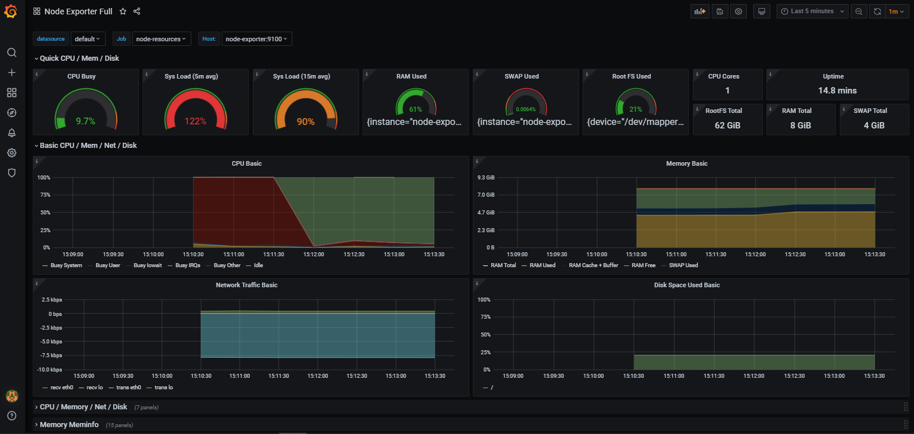
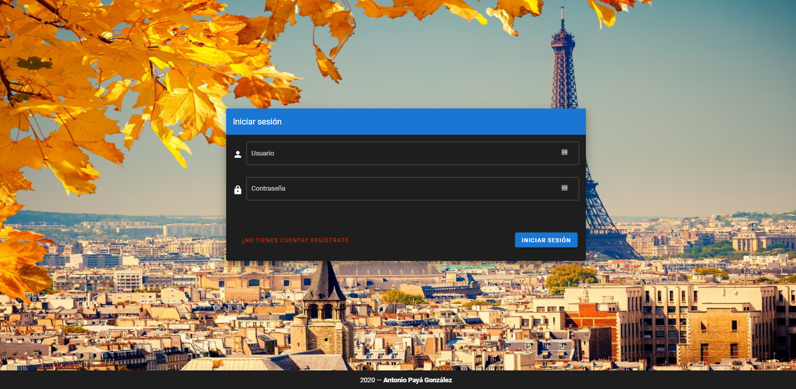
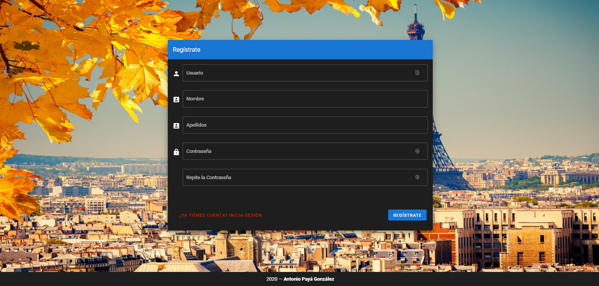
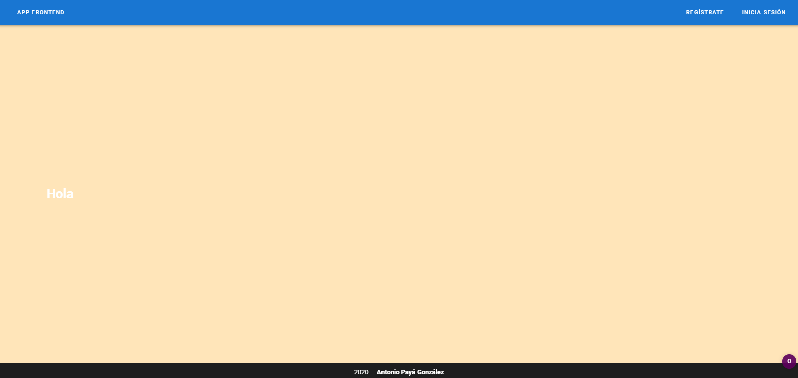

# Microservices Project Template


Microservices Project template with Prometheus, Grafana, Node-Exporter, .NET Core Backend and VueJS Frontend.





---

## Building and running

```
make run
```

Once the script is executed, the following urls will be accessible:

- **backend:** http://backend:5000 / http://127.0.0.1:5000
- **frontend:** http://frontend / http://127.0.0.1
- **grafana:** http://grafana:3000 / http://127.0.0.1:3000

## Check containers

```
make status
```

## Clean docker images and containers

Clean containers:
```
make remove
```

Clean images:
```
make remove-img
```

### Setting up Grafana

- **User**: admin
- **Password**: antonio (It can be modified in the docker-compose.ym file)

> It is recommended to create a new Dashboard specifically for node-export methods. To do this you must go to "Import" and enter the Dashboard code 1860