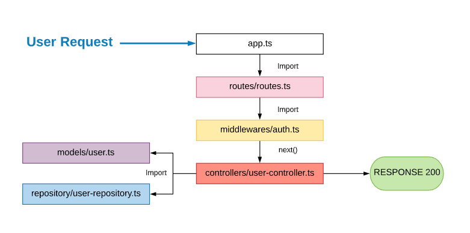

# TypeScript-API-REST-Template

[](https://travis-ci.com/antonioalfa22/TypeScript-API-REST-Template)
[](https://github.com/ellerbrock/open-source-badge/)
[](https://github.com/antonioalfa22/TypeScript-API-REST-Template)
[](https://github.com/antonioalfa22/TypeScript-API-REST-Template)
[](https://github.com/antonioalfa22/TypeScript-API-REST-Template/fork)


## 1. Estructura y Flujo

```bash
└───src
    ├───controllers
    ├───models
    ├───middlewares
    ├───repository
    ├───routes
    └───test
```



### 1.1. Models

Representa el modelo de datos, (por ejemplo un usuario).

### 1.2. Repository

Se encargan de proporcionar los métodos de acceso a base de datos para trabajar con los modelos (Entidades).

### 1.3. Middlewares

Son los componentes encargados de comprobar si se debe o no seguir con la petición. Por ejemplo autorización o roles.

### 1.4. Controllers

Los controladores son los encargados de realizar las operaciones requeridas por la petición definida en la ruta.

_______

## 2. Ejecutar

Para ejecutar la API-Rest en modo de desarrollo o testeo se deben ejecutar las siguientes instrucciones:

```node
npm install
npm run dev
```

Para ejecutar la API-Rest en producción se deben de realziar los siguientes pasos:

1. **Set .env**

Se necesita crear un archivo de configuración `.env` como el siguiente:

```env
MODE = test
```

2. **Run**

```node
npm install
npm run prod
```

## 2. Ejecutar con Docker

1. **Set .env**

Se necesita crear un archivo de configuración `.env` como el siguiente:

```env
MODE = test
```

2. **Build**

```docker
docker build . -t api-rest:latest
```

3. **Run**

```docker
docker container run --publish 3000:3000 --detach api-rest
```